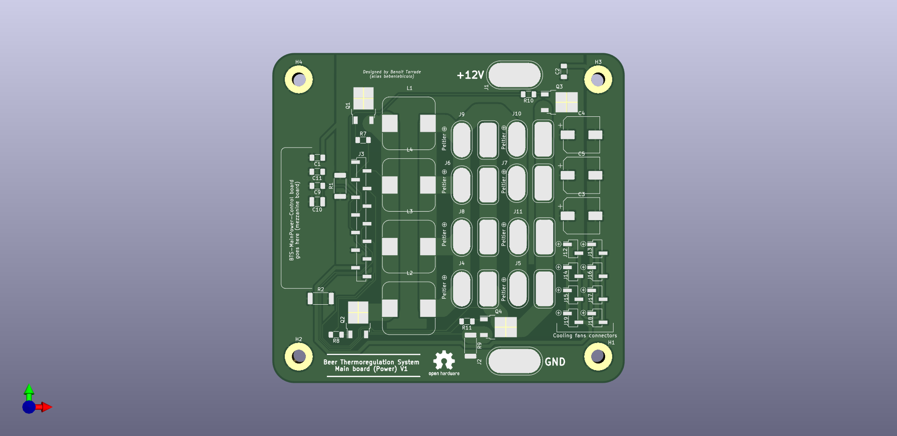

# BTS-Mainboard-Power's Index

- [BTS-Mainboard-Power's Index](#bts-mainboard-powers-index)
- [Description](#description)
- [Modularity](#modularity)
- [Issues and limitations](#issues-and-limitations)

# Description
Beer thermoregulation system mainboard  - power section
This single sided board made with aluminum substrate carries an H-bridge which drives 8 peltier modules (10x10mm, 12VDC, 6.7A each) in parallel in either direction.
It was designed with modularity in mind and good thermal dissipation properties, and this alone drove the design into the aluminum substrate land.

# Modularity
Modularity is achieved via a standard 2.54 mm pitch header connector which is used to carry the Control board in a mezzanine configuration (boards V0.1.0 and V0.2.0).
It allows to iterate on the control board without having to change anything on the power board itself.

# Issues and limitations
This board has several critical issues that renders it more or less useless.
1. Gate drivers do not implement shoot through protection !
   * As a consequence, I destroyed many mosfets many times because of transient signals being interpreted either as high or low (due to noise on driver's input signal). This resulted in many shoot through occurrences, and if the board effectively spread and dissipated the heat, it was not enough to take the 40A/12V power burst (and potentially even much more).
2. Soldering on this board is a real nightmare
   * I can say the aluminum substrate is very nice when it comes to dissipate heat. So nice that it made the assembly process a real nightmare, without speaking about the single-sidedness of the board which prevents any through-hole component use.
3. The return current track for the ALO mosfet is far to skinny ! It still has the default 0.25 mm width, no doubt as to why it could not handle high powers.
4. Having the mezzanine control board increases chances to pick up EMI and noise, which is not nice.
5. Mosfets are not as "modern" as they could be, I think I can switch to smaller ones that will handle more current just as well
6. Mosfets are spread out on the board the same way they are layed out in schematic : as a consequence they are quite far away from the gate driver, with a ground plane under them still (the aluminum substrate is grounded). Shortening the gate path will help improve their performance and reduce shoot-through potentialities.

All those issues shall be taken care of in the next revision.
Amongts other things, mosfets will be relocated, the board will be switched to a 4 layer configuration and mosfet drivers will finally be carried by this board as well.
I won't use the mezzanine topology anymore, so the whole Beer Thermoregulation System will only need 2 boards instead of 3 (which is more cost effictive).
As we'll be losing the good thermal conductivity of the aluminum substrate, special care shall be taken in order to dissipate the heat properly.
Finally, tracks will also need to be beefed up a little bit, eventually providing a way to add thick copper wire on the surface of the board in order to safely carry the 40A+.