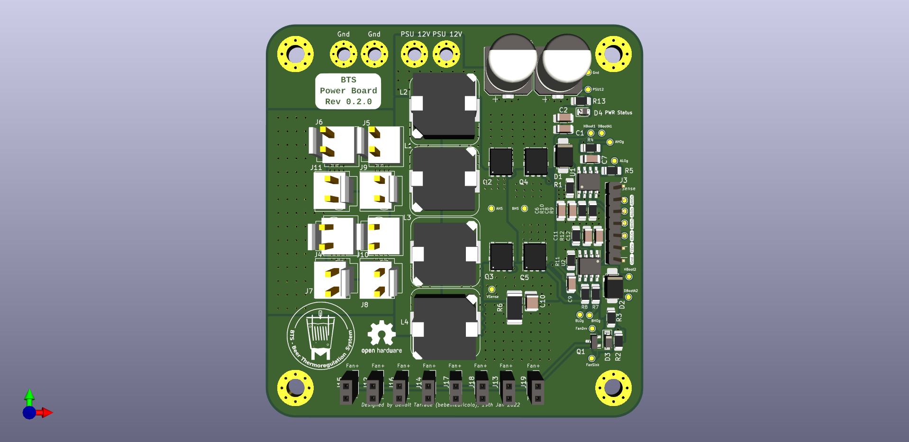
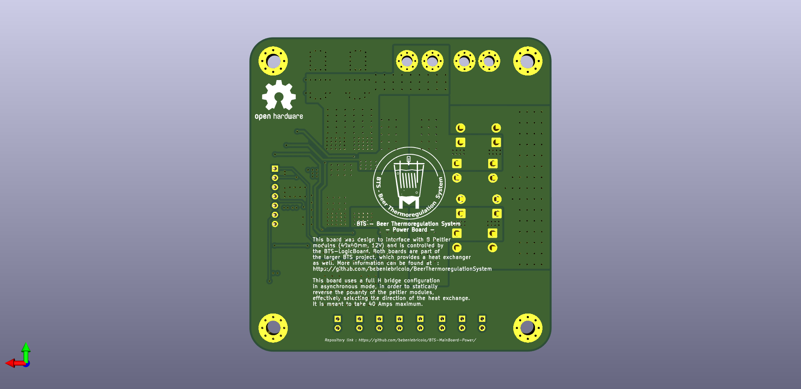

# BTS-Mainboard-Power's Index

- [BTS-Mainboard-Power's Index](#bts-mainboard-powers-index)
- [Description (Revision 0.2.0)](#description-revision-020)

# Description (Revision 0.2.0)
Beer thermoregulation system mainboard  - power section
This single sided board made a 4 layers PCB stackup carries an H-bridge which drives 8 peltier modules (10x10mm, 12VDC, 6.7A each) in parallel in either direction.

